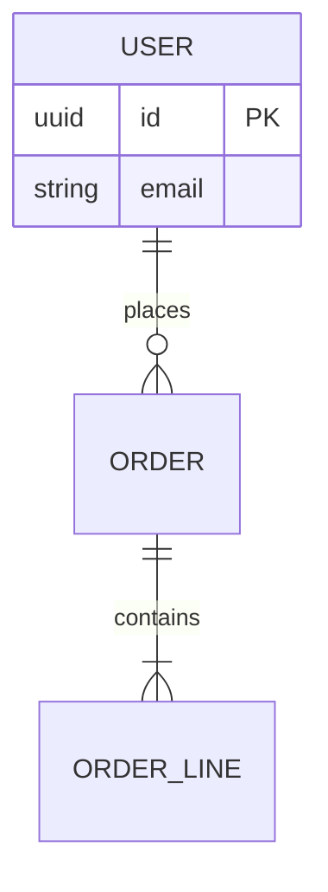

# ERD: <Feature>

**Ticket:** <feature/NN>
**Inputs:** <docs/inputs/...>

```mermaid
erDiagram
  USER ||--o{ ORDER : places
  ORDER ||--|{ ORDER_LINE : contains
  USER {
    uuid id PK
    string email
  }
```

## Changes against the current data model

| Entity | Change | Reason (ADR) |
|---|---|---|
