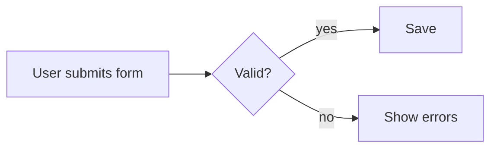
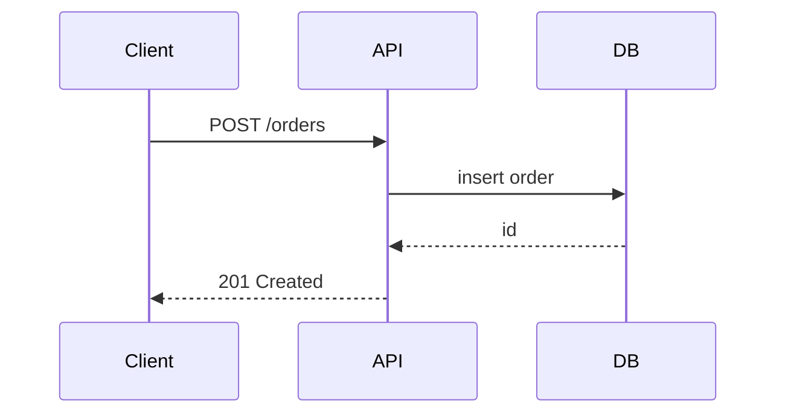

# Flow: <Name>

**Ticket:** <feature/NN>

```mermaid
flowchart LR
  A[User submits form] --> B{Valid?}
  B -- yes --> C[Save]
  B -- no --> D[Show errors]
```

## Sequence (cross-service calls)

```mermaid
sequenceDiagram
  participant C as Client
  participant API
  participant DB
  C->>API: POST /orders
  API->>DB: insert order
  DB-->>API: id
  API-->>C: 201 Created
```

## Failure paths

- <What happens when ...>
