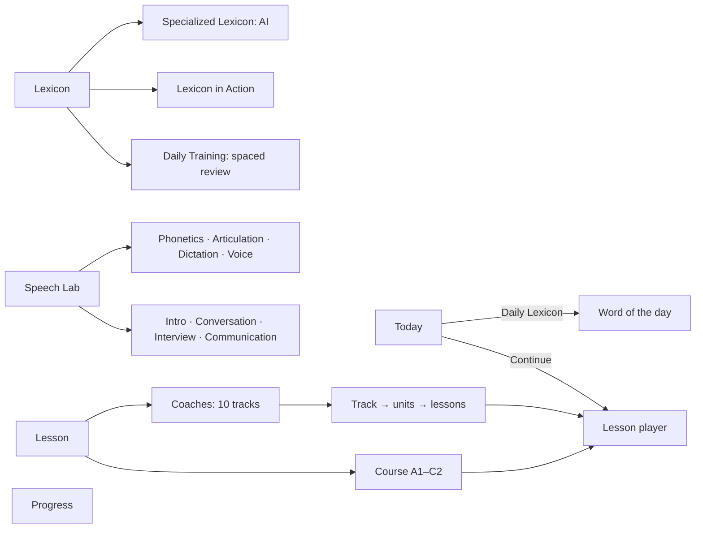
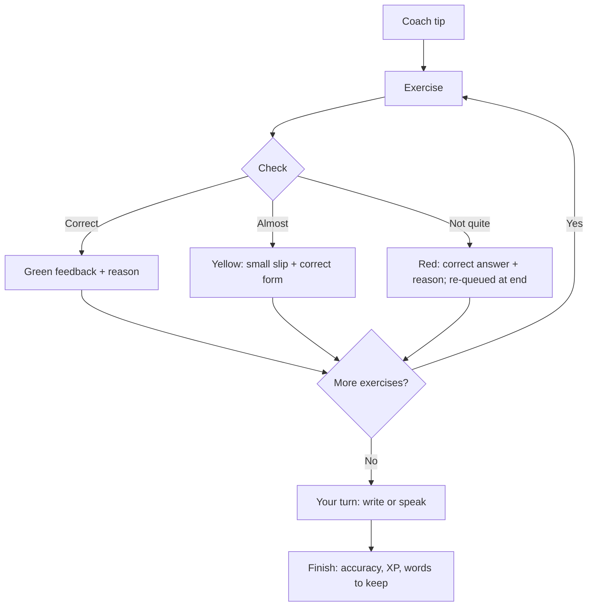
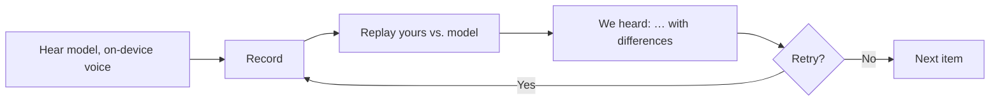

# User flows (v2)

## Navigation

```mermaid
flowchart LR
  T[Today] -->|Continue| LP[Lesson player]
  T -->|Daily Lexicon| DL[Word of the day]
  X[Lexicon] --> VR[Daily Training: spaced review]
  X --> LA[Lexicon in Action]
  X --> SL[Specialized Lexicon: AI]
  L[Lesson] --> C[Course A1–C2]
  L --> K[Coaches: 10 tracks]
  C --> LP
  K --> U[Track → units → lessons] --> LP
  S[Speech Lab] --> PR[Intro · Conversation · Interview · Communication]
  S --> PH[Phonetics · Articulation · Dictation · Voice]
  P[Progress]
```

## Lesson

```mermaid
flowchart TD
  A[Coach tip] --> B[Exercise]
  B --> C{Check}
  C -->|Correct| D[Green feedback + reason]
  C -->|Almost| E[Yellow: small slip + correct form]
  C -->|Not quite| F[Red: correct answer + reason; re-queued at end]
  D --> G{More exercises?}
  E --> G
  F --> G
  G -->|Yes| B
  G -->|No| H[Your turn: write or speak]
  H --> I[Finish: accuracy, XP, words to keep]
```

## Speech Lab — articulation

```mermaid
flowchart LR
  M[Hear model, on-device voice] --> R[Record] --> P[Replay yours vs. model] --> W["We heard: …" with differences] --> X{Retry?}
  X -->|Yes| R
  X -->|No| N[Next item]
```
